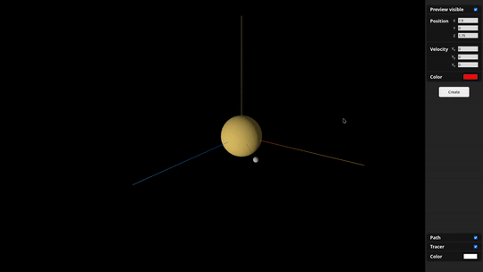

# Orbital-Sim-JS

A 3D orbits simulator with Newtonian Physics. You can add as many satellites as you want, change their color and toggle on and off their paths and tracers. 

Some new features could still be implemented, but I feel like the main objective for this project is done.

## Known bugs
- If a satellite's initial position is (0,0,0) - planet's position -, an error is thrown because of a NaN value in the function .setPoints();
- If a satellite collides, its button does not disappear and the indices/satellites become wrongly identified.

